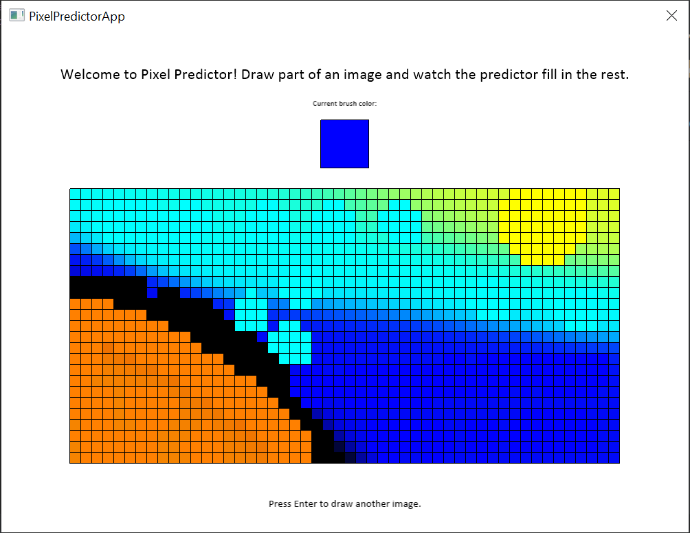
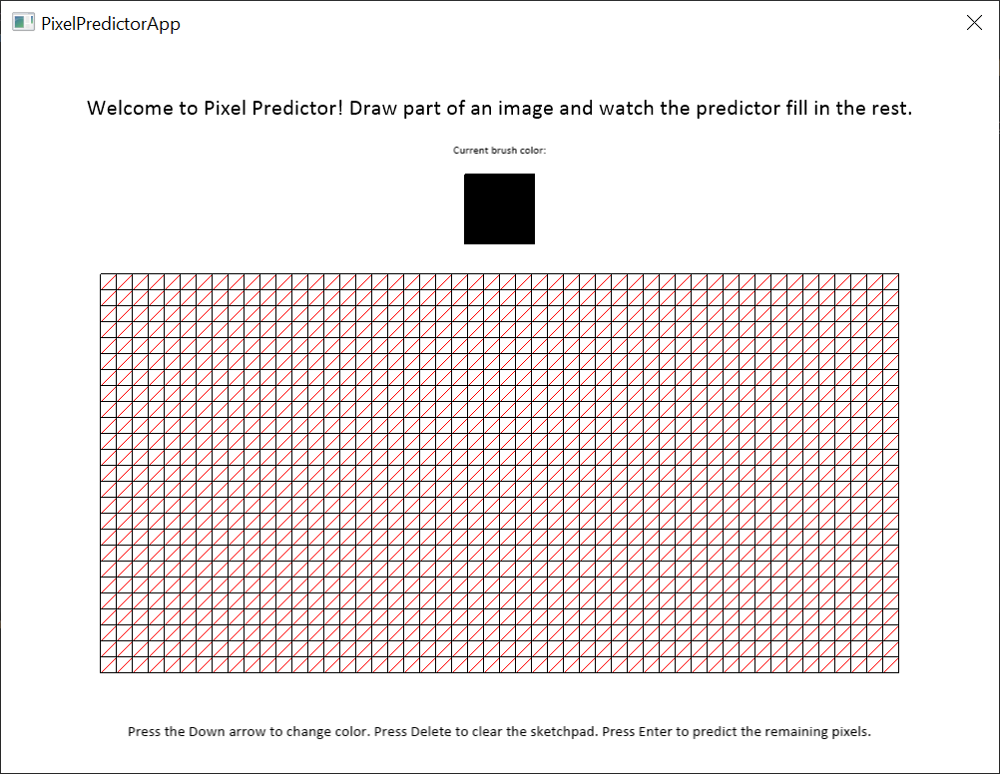
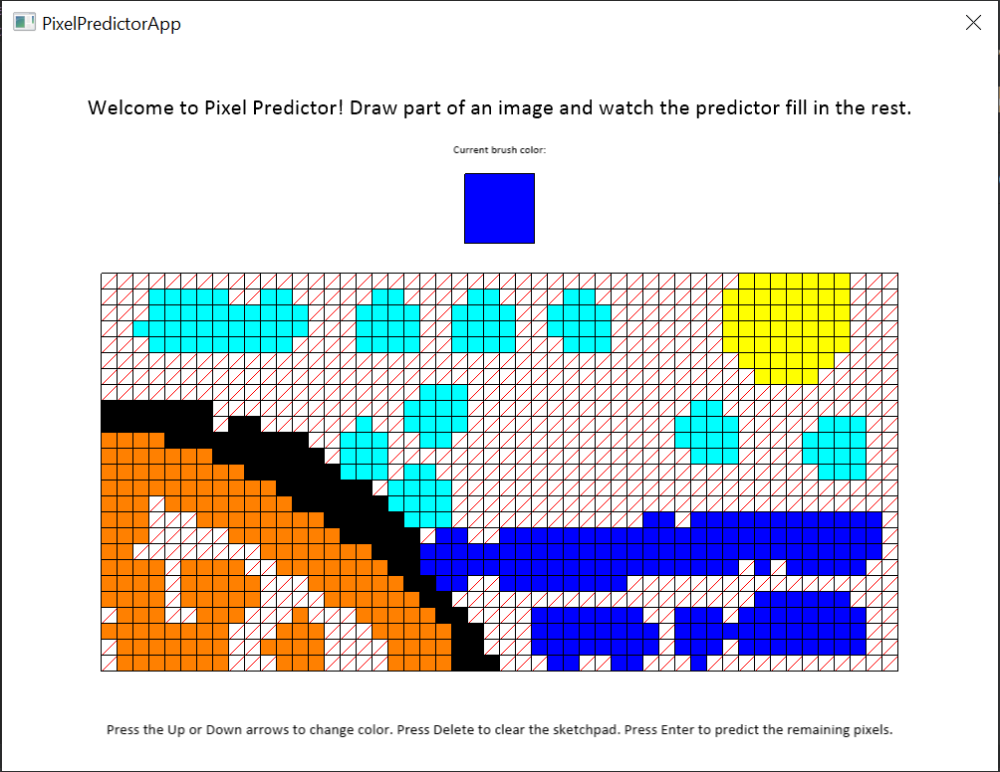

# Pixel Predictor: Image Completion Using a Neural Network

## What is Pixel Predictor?

Pixel Predictor is a fun image completion application that fills in gaps in a user-drawn image. The appliction trains a 
basic neural network on pixels painted by the user and then predicts the colors of the remaining blank pixels. 

## Usage

### User

Pixel Predictor first presents a blank sketchpad with a welcome message, a color swatch, and a list of controls.

The user paints by clicking and dragging the mouse, switching colors with the Up and Down arrow keys. The Delete key 
clears the canvas, and the Enter key submits the image for completion.

After the user presses the Enter key, Pixel Predictor displays the predicted results.

Clicking the Enter key returns to the original blank canvas, on which the user can draw another image.

### Developer

Pixel Predictor relies on a PredictorEngine object holding a NeuralNetwork object that represents a basic neural network with customizable layers 
and weights. Using the NeuralNetwork, the PredictorEngine processes data and predicts the output of new data. 

Visualization is done by a PixelPredictorApp object with a Sketchpad object handling the user-painted input. 

## Building the Project

Pixel Predictor was developed using Windows 10 and may not function properly on other operating systems. 

External libraries:
* [Cinder](https://libcinder.org/) (Visualization): Download Cinder and create the project inside the Cinder folder. 
* [Catch2](https://github.com/catchorg/Catch2) (Unit testing): Library added in CMakeLists file already.

The application executes using pixel-predictor.
